# Multen Operator

The Multen Operator is a Kubernetes operator which provides secure multi-tenant access to an application via an authentication provider and separated data storage. **Currently the only providers are Envoy Gateway + Keycloak for authentication and PGO for data storage**

## Why does this project exist?

This project exists mainly to teach myself how to write Kubernetes operators in Go. However - if you are looking for a solution to provide multi-tenant access to your application, this operator may be useful to you as well!

## What does it do?

The operator watches for custom resources of type `Tenant`. When a new `Tenant` resource is created, an Organization is created in Keycloak for that tenant. 

The operator also watches `Product` objects - these are used to create Keycloak clients for each tenant, allowing them to log in to the application. 

Finally, the operator watches `ProductDatabase` objects - these are used to create database cluster objects in PGO with one database for each tenant - thereby providing separated data storage for each tenant. You can have multiple ProductDatabase objects for each product - allowing you to choose between monolithic and microservice architectures.

## How do I contribute? 

If you want to contribute to this project, please fork the repository and create a pull request with your changes. I will review the pull request and merge it if it is appropriate. 

## License 

This project is licensed under the Apache 2.0 License - see the [LICENSE](LICENSE) file for details.